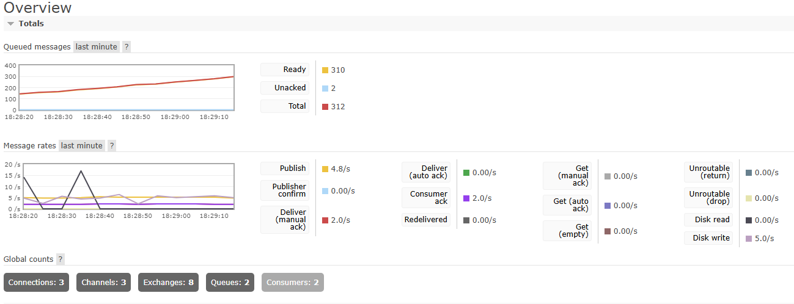
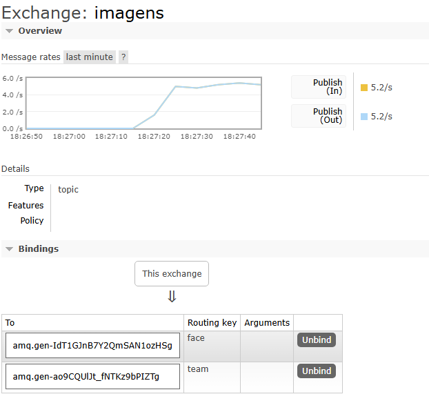

# 🖼️ Sistema Distribuído de Classificação de Imagens com RabbitMQ

Este é um sistema distribuído simples de envio e consumo de imagens via RabbitMQ. O sistema contém consumidores responsáveis por identificar rostos humanos e brasões de times, utilizando simulações de inteligência artificial desenvolvidas em Python.

---

## 📥 Instalação

### 🔧 Requisitos

Certifique-se de ter instalado:

- Docker.
- Docker Compose.
- Python 3.8 ou superior (caso queira executar localmente).
- Pip (gerenciador de pacotes do Python).

As seguintes bibliotecas Python são utilizadas nos serviços:

- `pika`: comunicação com o RabbitMQ.
- `pillow`: geração e manipulação de imagens.
- `base64`: codificação e decodificação de imagens.
- `io`: manipulação de streams em memória.
- `time`, `random`: simulação de atrasos e aleatoriedade.

---

### 📌 Passos para instalação

### 1️⃣ Clone o repositório

```bash
git clone https://github.com/seuusuario/projeto-imagens-rabbitmq.git
cd projeto-imagens-rabbitmq
```

### 2️⃣ Suba os serviços com Docker Compose

```bash
docker-compose up --build
```

### 3️⃣ Acesse o RabbitMQ (opcional)

- URL: http://localhost:15672
- Usuário: guest.
- Senha: guest.

---

## 🎮 Funcionalidades

- Envio contínuo de imagens simuladas (para rosto, para brasão).
- Classificação de rostos com o consumer-face.
- Identificação de time com o consumer-team.
- Mensageria assíncrona com RabbitMQ usando exchange do tipo topic.
- Arquitetura modular e escalável.

---

## 🧠 Funcionamento do Sistema

1. O serviço `message-generator` cria imagens codificadas em base64 e as envia para a exchange `imagens` com a routing key `face` ou `team`, dependendo do conteúdo gerado.

2. O serviço `consumer-face` escuta mensagens com a routing key `face`, decodifica a imagem, executa a análise facial e imprime o resultado.

3. O serviço `consumer-team` escuta mensagens com a routing key `team`, decodifica a imagem, identifica o brasão e imprime o resultado.

4. Cada consumidor usa `basic_ack` para confirmação da mensagem e `basic_qos` para limitar o número de mensagens pré-buscadas.

---

## 📸 Imagens do Rabbitmq

### 🔹 **Overview**



### 🔹 **Exchange**



---

## 🏗 Estrutura do Projeto

```plaintext
projeto-imagens-rabbitmq/
├── consumer-face/
│   ├── consumer_face.py
│   └── model_face.py
│   └── Dockerfile
├── consumer-team/
│   ├── consumer_team.py
│   └── model_team.py
│   └── Dockerfile
├── message-generator/
│   └── generator.py
│   └── Dockerfile
├── docker-compose.yml
└── README.md
```

---

## 🐳 Containers Executados

- `rabbitmq`: servidor RabbitMQ com painel web na porta 15672.
- `generator`: envia imagens automaticamente com routing keys aleatórias.
- `consumer_face`: processa e analisa imagens de rosto.
- `consumer_team`: processa e identifica brasões de time.

---

## 👨‍💻 Autores

Davi Rodolfo e Melissa Alves

---
